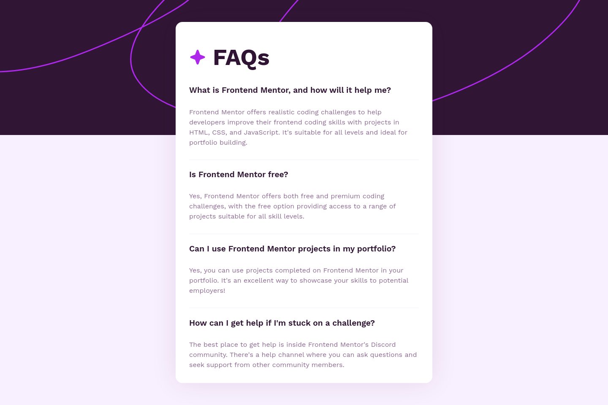

# Frontend Mentor - FAQ accordion solution

Most new members probably do not know that [this challenge](https://vanzafaqaccordioncard.netlify.app/) was [a lot harder than this](https://github.com/vanzasetia/faq-accordion-card). Plus, most beginners who had done this challenge failed horribly because the layout was very challenging to handle.

Putting the historical background aside, I did this challenge again to say to people, "I know what you think. But you are _wrong_" in a friendly and constructive manner.

Do not worry. I am still learning, but in a way that you will _not_ expect.

## The challenge

Users should be able to

- hide or show the answer to a question when **the question is clicked**; and
- navigate the questions and hide/show answers using keyboard navigation alone; and
- view the optimal layout for the interface depending on their device's screen size; and
- see hover and focus states for all interactive elements on the page; and
- see _all_ the information on the page even when the _JavaScript fails_ to run.

## What I learned

Most people, especially beginners, only see this challenge as something simple and easy. But their code proves the opposite. Underestimating Frontend Mentor challenges leads them to code without any reason—or worse, they do not know what they wrote. Here, I am telling you what most people do wrong, how they think, and what to do instead.

### Rejecting the use of the native HTML elements

HTML offers us two semantic elements to make an accordion: `<summary>` and `<details>`. However, I did not use those elements here because, while they are native HTML elements, they [are not supported by Safari browsers](https://developer.mozilla.org/en-US/docs/Web/HTML/Reference/Elements/summary#browser_compatibility) and are not easy to customize. More importantly, this challenge is provided to test my JavaScript skills. I would waste this opportunity if I used those elements.

Without those elements, I had the freedom to set the markup however I wish. But too much freedom can cause too many issues because building a mess-up accordion is easy. The `div` element can be used. Any elements can be used. To develop an accessible accordion, I needed to know what users expected to, and [I already knew about it](#the-challenge).

All I needed to do was use the heading elements for the question and the `button` element for the icon button. The `button` element has built-in keyboard functionality where users can use the `Tab` key to navigate to another button and the `Space` bar to interact with it. This means I did not have to waste my time writing JavaScript for the features. You don't like wasting your time either, right? However, I still needed to make the headings listen to the click event, and that could be done quite easily.

The button icon needs a label. Most beginners may use the `img` element, and they write "Plus icon" or "Minus icon" for the alternative text. That is simply wrong. Users do not need such information. In this case, users need to know what this button is for, and this button is for the question. This means our job is to connect every button with the question programmatically. To do our job of making an accessible accordion, we need to use a [forbidden technique](https://www.w3.org/TR/using-aria/): using ARIA attributes.

I decided to use `aria-describedby` over `aria-labelledby`. There are no significant reasons for it. But I would argue that the icon button here needs a description rather than a label. A label tells users the purpose of the button, such as "Delete" for a delete button or "Reset" for a reset button. This means that for a general-purpose button, a label is more suitable than a description. Now it does not make sense to say "What is Frontend Mentor, and how will it help me?" for an accordion button. It is not a general button. It is for specific content. So I decided to use `aria-describedby` over `aria-labelledby`.

To sum up, a custom accordion is as simple as having the following markup:

```html
<h2 id="what-is-frontend-mentor">
  What is Frontend Mentor, and how will it help me?
</h2>
<button
  type="button"
  aria-expanded="true"
  aria-label="open section"
  aria-describedby="what-is-frontend-mentor"
></button>
```

### Building the project with progressive enhancement in mind

JavaScript in this case must be used for enhancement only. Most beginners will think that [JavaScript always arrives](https://www.kryogenix.org/code/browser/everyonehasjs.html) and runs on the user's browser. But they do not know that **all users are non-JavaScript users until their script runs**. They do not know that users can block their JavaScript through either installed extensions or by disabling JavaScript through the browser's settings. The reality is not that simple. It is very complex and unexpected.

Take a look at this screenshot:



I bet that most beginners, if not all, did not even think to do this challenge with a no-JavaScript approach. Even those who have paid for Udemy courses may not even think that a solution without JavaScript should exist. They simply focus on one optimistic solution where JavaScript always runs successfully on the user's browser, and everybody has the latest version of Google Chrome. But guess what? They are wrong.

On a slow connection, JavaScript can fail to load. A bug in the browser can cause JavaScript to fail on the first load—sometimes I experienced this.

My solution works with and without JavaScript. The users will not lose any content because I prioritize content first. In case you do not know, browsers always prioritize content over fancy features. This is why [the first ever website on the internet](https://info.cern.ch/hypertext/WWW/TheProject.html) survives until now.

**Even better, my solution works with just HTML only**.

### Using inline SVG without unnecessary repetitions

One way to use SVG elements is to use them with the `img` element.

```html

```

The problem with that approach is that you can not use CSS to style it. You also can not use JavaScript to animate it. Simply, you lose lots of cool SVG features by using the `img` element to render SVGs.

Another way to use SVG is to copy the entire SVG code and make it inline.

```html
<svg
  xmlns="http://www.w3.org/2000/svg"
  width="30"
  height="31"
  fill="none"
  viewBox="0 0 30 31"
>
  <path
    fill="#301534"
    d="M15 3.313A12.187 12.187 0 1 0 27.188 15.5 12.2 12.2 0 0 0 15 3.312Zm4.688 13.124h-9.375a.938.938 0 0 1 0-1.875h9.374a.938.938 0 0 1 0 1.876Z"
  />
</svg>
```

In most cases, this is fine, except you have to repeatedly copy-paste the code. This leads to bloated HTML because you repeatedly add the SVG code. More importantly, unlike this project, which _will never change_, a real project may require changing a set of icons in the future. You will have a hard time replacing the old icons by copy-pasting the new icon to each chunk of the HTML.

The best way to do it is to have an inline sprite element that contains all the SVG elements.

```html
<div hidden>
  <svg xmlns="http://www.w3.org/2000/svg" focusable="false">
    <symbol id="minus" width="30" height="31" viewBox="0 0 30 31">
      <path
        d="M15 3.313A12.187 12.187 0 1 0 27.188 15.5 12.2 12.2 0 0 0 15 3.312Zm4.688 13.124h-9.375a.938.938 0 0 1 0-1.875h9.374a.938.938 0 0 1 0 1.876Z"
      />
    </symbol>
    <!-- More <symbol> here for more icons -->
  </svg>
</div>
```

This way, you do not copy-paste SVG elements many times. To use it, you need to write the following:

```html
<svg
  width="30"
  height="31"
  viewBox="0 0 30 31"
  aria-hidden="true"
  focusable="false"
>
  <g fill="#301534">
    <use href="#minus"></use>
  </g>
</svg>
```

### Labelling the button with a visible label

Most beginners may use `aria-label` because that is what most mentors will suggest. But `aria-label` is not a visible label. It is programmatically visible to assistive technologies. But users who do not use assistive technologies—probably you—must have similar access to the label. In this case, the visible label for each accordion is the question. Plus, [`aria-label` does not always get translated](https://adrianroselli.com/2019/11/aria-label-does-not-translate.html).

I decided to use `aria-describedby` because the text is visible, the `h2` is visible, all users get the same description, and visible content gets translated. Win-win solution!

## Links

- Solution URL: https://www.frontendmentor.io/solutions/with-or-without-javascript-fully-responsive-faq-accordion-wahKyH4wdt
- Live Site URL: https://officialfaq.netlify.app/

## Built with

Accessibility in mind
Progressive enhancement

- Semantic HTML5 markup
- CSS custom properties
- Modern JavaScript
- Flexbox
- Mobile-first workflow
- No-JavaScript-first approach
